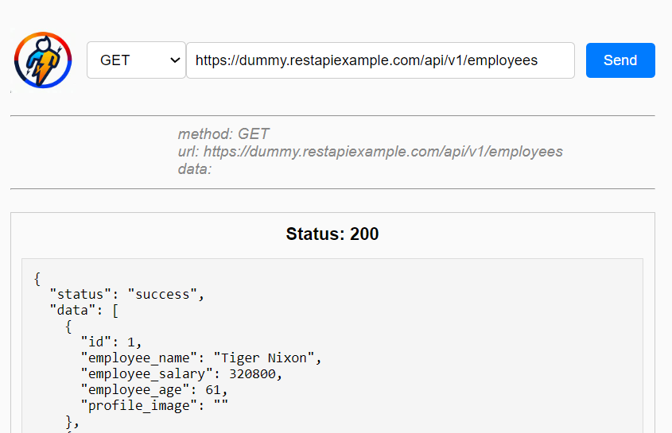

<!-- ABOUT THE PROJECT -->
# Thunderman


The Thunder-Man project is a React-based API testing software designed for API testing. With a user-friendly interface and support for various HTTP methods. Users can input endpoints and the software displays API response.

Use the `README.md` to get started.

<!-- BUILT WITH -->
# Built With

The Tech Stacks used are:

<div align="center">
  <a href="https://skillicons.dev">
      
  </a>
</div>

## Installation

1. Clone the repository to your local machine:

   ```bash
   git clone https://github.com/Chetan3327/thunder-man.git
   ```
2. Navigate to the project directory:

   ```bash
   cd thunder-man
   ```
3. Install dependencies:

   ```bash
   npm install
   ```

<!-- CONTACT -->
# Contact

Name: Chetan Chauhan - chauhanchetan12789@gmail.com

Project Link: https://thunderman.onrender.com/